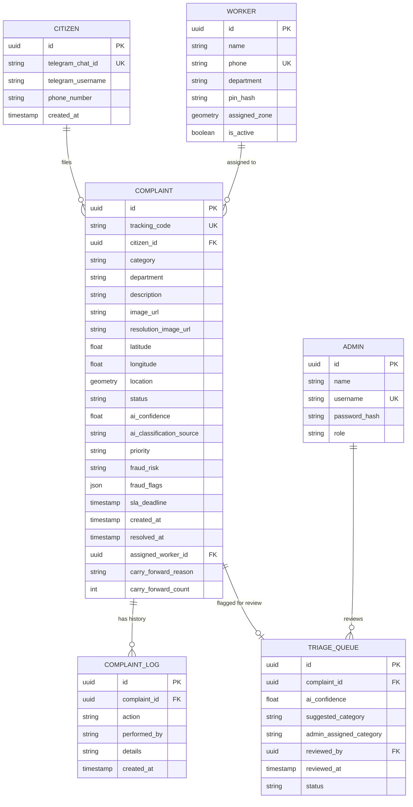
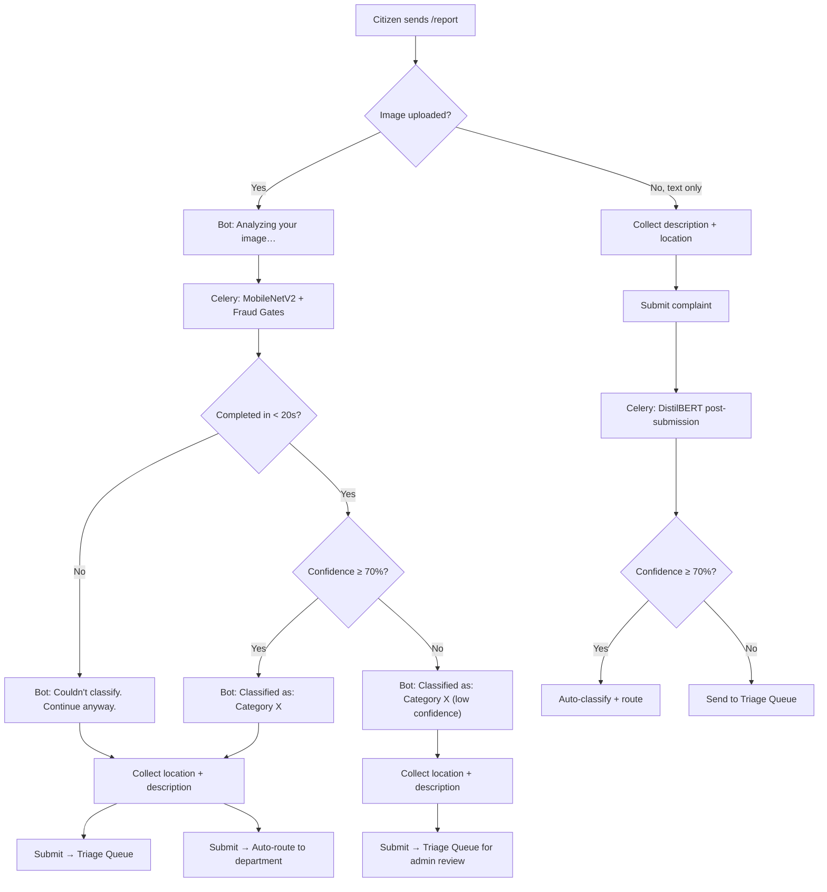

# Smart Civic Grievance Platform — System Architecture

> **Architect:** Your AI Copilot  
> **Date:** September 2026  
> **Status:** Planning Complete (Approved) ✅

---

## Confirmed Project Baseline

| # | What We Know | Source |
|---|-------------|--------|
| 1 | **Team of 3 members** | You confirmed |
| 2 | **No prior experience assumed** in Python, web dev, Docker, cloud, or DevOps | You confirmed — starting from scratch |
| 3 | **Primary goal is learning** Cloud/DevOps through building | Your project vision |
| 4 | **60-day timeline** | Your project vision |
| 5 | **Free-tier / zero-cost** constraint | Your project vision |
| 6 | **College project** but treated as a real industry project | Your project vision |
| 7 | **Google Colab** for ML model training (free GPU) | You confirmed |

> [!NOTE]
> **Why Python + FastAPI even if you don't know Python yet?**
> - Python has the **gentlest learning curve** of any backend language — you can be productive in days, not weeks
> - It's the **only language** that lets you do backend + AI/ML in the same ecosystem (no language switching)
> - FastAPI is the most **beginner-readable** modern framework (type hints, auto-generated docs, clear error messages)
> - The 60-day roadmap **accounts for learning time** — you'll learn each technology as you need it, not all upfront

---

## Architecture Philosophy

Three principles guided every decision:

1. **Learn by doing, not by overengineering** — Every tech is here because it teaches you something real. Nothing is here "just because."
2. **Free tier or bust** — Every component runs on free resources.
3. **Local-first development** — Everything runs on your machine via Docker Compose during development. AWS is only introduced at the deployment phase (Week 8). No cloud dependency until you're ready.
4. **Simple today, extensible tomorrow** — Start monolith-ish, split later if needed. You're learning — fighting distributed systems on Day 1 is a trap.

---

## High-Level Architecture

```
┌─────────────────────── THREE USER INTERFACES ────────────────────────┐
│                                                                       │
│  👨‍👩‍👦 CITIZEN              🏛️ ADMIN / SUPERVISOR      👷 FIELD WORKER   │
│  Telegram Bot            Web PWA (Desktop)          Mobile PWA       │
│  Report + Track          Dashboard · Triage         Tasks · Resolve  │
│  via chat                · Analytics · Maps         · Navigate · GPS │
│       │                        │                          │          │
└───────┼────────────────────────┼──────────────────────────┼──────────┘
        │ Webhook                │ HTTPS                    │ HTTPS
        ▼                        ▼                          ▼
┌─────────────────────────────────────────────────────────────────────┐
│                      BACKEND API SERVER                              │
│                    Python + FastAPI                                   │
│                                                                      │
│  ┌──────────┐  ┌──────────┐  ┌──────────┐  ┌───────────────────┐   │
│  │ Complaint │  │  Worker  │  │  Admin   │  │   AI/ML Service   │   │
│  │  Module   │  │  Module  │  │  Module  │  │   (Classification │   │
│  │          │  │          │  │          │  │    + Routing)     │   │
│  └──────────┘  └──────────┘  └──────────┘  └───────────────────┘   │
│                                                                      │
│  ┌──────────────────────────────────────────────────────────────┐   │
│  │                    Shared Services Layer                      │   │
│  │  Auth · Notifications · File Storage · SLA Tracker · Geo     │   │
│  └──────────────────────────────────────────────────────────────┘   │
└───────────┬────────────────┬────────────────┬───────────────────────┘
            │                │                │
            ▼                ▼                ▼
     ┌─────────────┐  ┌───────────┐   ┌─────────────┐
     │ PostgreSQL  │  │   Redis   │   │  MinIO/S3   │
     │  + PostGIS  │  │  (Cache + │   │  (Photos)   │
     │  (Database) │  │   Queue)  │   │             │
     └─────────────┘  └───────────┘   └─────────────┘
```

---

## Technology Stack — With Reasoning

### Backend

| Component | Technology | Why This? | Free? |
|-----------|-----------|-----------|-------|
| **Language** | **Python 3.11+** | You likely know it. Dominant in AI/ML. Massive ecosystem. Industry-standard for backend. | ✅ |
| **Web Framework** | **FastAPI** | Modern, async, auto-generates API docs (Swagger), type-safe, fast. Industry darling for Python APIs. Django is too heavy for this; Flask is too barebones. | ✅ |
| **Telegram Bot** | **python-telegram-bot** | Official, well-documented, async support, handles webhooks | ✅ |
| **Task Queue** | **Redis + Celery** | For background jobs: AI classification, notifications, SLA checks. Redis doubles as cache. | ✅ |
| **ORM** | **SQLAlchemy 2.0 + Alembic** | Industry-standard Python ORM. Alembic handles DB migrations (version-controlled schema changes). | ✅ |

### AI/ML Pipeline

| Component | Technology | Why This? |
|-----------|-----------|-----------|
| **Image Classification** | **MobileNetV2 (fine-tuned)** | Pre-trained on ImageNet, lightweight (~3.4M params), runs on CPU, perfect for 5-class classification. Train on Google Colab. **Chosen over EfficientNet-B0** (~5.3M params, 77% vs 72% top-1) because: (a) 5 visually distinct categories don't need the accuracy edge, (b) faster on CPU, (c) swapping to EfficientNet-B0 is a one-line change if accuracy disappoints. |
| **Text Classification** | **DistilBERT (fine-tuned)** | 66M params, 60% faster than BERT, accurate enough for 5-class text classification. Trainable on Colab via Hugging Face Transformers. |
| **ML Framework** | **TensorFlow / Keras** | Simpler API than PyTorch for fine-tuning tasks. Native on Google Colab. `tf.keras.applications.MobileNetV2` is literally 3 lines of code. Since ML isn't the learning focus, simpler = better. |
| **Model Serving** | **Built into FastAPI** | Load model on startup, serve predictions via API endpoint. No separate ML serving platform needed at this scale. |
| **LLM (Optional)** | **Adapter Pattern** | Abstract `LLMProvider` interface → swap between local (Ollama + TinyLlama) or cloud (Groq free API / Google Gemini free tier) without code changes. |

> [!IMPORTANT]
> **ML/AI is a supporting component, NOT a primary learning domain.**
> Your learning priorities are: **DevOps → Cloud → Software Engineering** (not deep SDE — just enough SE fundamentals to build the DevOps muscle and become a competent DevOps/Cloud candidate).
> The AI models just need to work — they're a feature of the product, not the focus of your learning. The training notebooks on Colab will be fairly templated. Your real learning happens in everything *around* the models: containerizing them, serving them via API, deploying them, CI/CD for model updates, etc.

> [!NOTE]
> **About the "0.5 million parameter" LLM you mentioned:** A 0.5M param model is too small to be a useful LLM (GPT-2 Small is 124M). I think you meant either a lightweight classifier (which MobileNetV2/DistilBERT covers) or a small LLM like TinyLlama (1.1B params) run locally via Ollama. I've designed for both via the Adapter Pattern — you can decide later.

### Database

| Component | Technology | Why This? |
|-----------|-----------|-----------|
| **Primary Database** | **PostgreSQL 16** | Industry gold standard. Free. Handles relational data, JSON, full-text search, and with PostGIS — geographic queries (nearest worker, hotspot detection). |
| **Geospatial** | **PostGIS extension** | Enables `ST_Distance`, `ST_Within` queries for worker zone matching and hotspot maps. No need for a separate geo service. |
| **Cache / Queue Broker** | **Redis 7** | In-memory. Caches dashboard stats, serves as Celery's message broker. One tool, two jobs. |
| **File Storage** | **MinIO** (local) → **AWS S3** (prod) | MinIO is S3-compatible, runs in Docker for local dev. Switch to real S3 in production. Stores complaint photos and resolution photos. |

> [!TIP]
> **Why not MongoDB?** I know it's popular in tutorials, but PostgreSQL does everything MongoDB does (via JSONB) plus relational integrity, geographic queries, and is more industry-demanded for backend roles. Learning Postgres is a better investment.

### Frontend — Three Distinct Interfaces

| Interface | Type | Optimized For | Key Features |
|-----------|------|---------------|-------------|
| **Citizen** | **Telegram Bot** | Any phone with Telegram | Report via photo/text/GPS, track complaint status, receive resolution notifications |
| **Admin / Supervisor** | **Web PWA (Desktop-first)** | Desktop/laptop browser | Dashboard, charts, hotspot maps, triage queue, worker management, data export |
| **Field Worker** | **Mobile PWA (Mobile-first)** | Phone browser | Task queue, GPS navigation, camera for resolution photos, offline task caching |

#### Tech Stack

| Component | Technology | Why This? |
|-----------|-----------|-----------|
| **Framework** | **Vue 3 (Composition API)** | Intuitive `<script setup>` syntax, reactive state primitives (`ref`, `reactive`), and single-file components (`.vue`). One codebase, two experiences (admin vs worker) via role-based routing. |
| **Styling & UI** | **Bootstrap 5 + Bootstrap Icons** | Responsive 12-column grid, mobile-first utility classes, prebuilt UI components (cards, badges, modals, alerts), and lightweight SVG icons without heavy UI overhead. |
| **Build Tool / Bundler** | **Vite** | Official Vue 3 tooling created by Evan You. Sub-millisecond HMR, lightning-fast dev server, and optimized Rollup-based production builds. |
| **PWA** | **Vite PWA Plugin (Workbox)** | Generates `manifest.json` + Service Worker. Makes the app installable on home screens, enables offline caching, and supports background sync/push notifications. |
| **State Management** | **Pinia** | Official Vue 3 lightweight store. Modular, fully typed, manages global auth session, worker active tasks, and real-time queues. |
| **Routing** | **Vue Router 4** | Official Vue router with navigation guards for role-based access control (Admin dashboard vs Worker task queue). |
| **Charts** | **Chart.js + vue-chartjs** | Clean, responsive charting library that pairs naturally with Bootstrap admin dashboards. |
| **Maps** | **Leaflet** | Free, open-source maps (OpenStreetMap) integrated into Vue components. No API key needed. Shows complaint locations, hotspots, worker zones. |
| **HTTP Client** | **Axios** | Clean API calls with interceptors for JWT tokens and error handling. |

#### PWA Capabilities

| Capability | Admin PWA | Worker Mobile PWA |
|-----------|-----------|-------------------|
| **Installable** ("Add to Home Screen") | ✅ | ✅ |
| **Offline fallback** (show cached data when offline) | Basic | ✅ Critical — workers may lose signal in the field |
| **Push notifications** (new complaint assigned) | ✅ | ✅ |
| **Camera access** (resolution photo upload) | ❌ | ✅ |
| **GPS/Geolocation** | ❌ | ✅ |
| **Responsive layout** | Desktop-first | Mobile-first |

> [!TIP]
> **One codebase, two PWA experiences.** The admin and worker portals share the same Vue project but behave differently:
> - **Role-based routing** — after login, admins see dashboard views, workers see task views
> - **Responsive layouts** — admin views are desktop-optimized (Bootstrap grid tables, wide charts), worker views are mobile-optimized (cards, large buttons, bottom nav)
> - **Single build, single deploy** — no need to maintain two separate frontend projects
> - **Two `manifest.json` configs** — different app names, icons, and theme colors per role

### Infrastructure & DevOps

#### 🖥️ Local Development (Week 1–7) — Everything runs on your machine

| Component | Technology | Why This? | Free? |
|-----------|-----------|-----------|-------|
| **Containers** | **Docker + Docker Compose** | One `docker compose up` runs the entire stack locally. Essential DevOps skill. | ✅ |
| **File Storage** | **MinIO** | S3-compatible object storage that runs locally in Docker. Stores complaint/resolution photos. Swaps to real S3 at deployment. | ✅ |
| **CI/CD** | **GitHub Actions** | Runs on every PR from Day 1 — lint, test, build. Free for public repos. | ✅ |
| **Version Control** | **Git + GitHub** | Branching, PRs, protected branches, code reviews with your team. | ✅ |
| **Monitoring** | **FastAPI health endpoints + structured logging** | `/health` and `/ready` endpoints. JSON logs to stdout. | ✅ |
| **Logging** | **Structured JSON logs + Python logging** | JSON-formatted logs, easy to search, no extra services. | ✅ |
| **Secrets** | **`.env` files + Docker Compose env** | Simple, local, gitignored. | ✅ |

#### ☁️ Production Deployment (Week 8+) — AWS introduced only at deploy time

| Component | Technology | Why This? | Free? |
|-----------|-----------|-----------|-------|
| **Cloud Provider** | **AWS (Free Tier)** | 12-month free tier. Most job-relevant cloud (~40% industry share). | ✅ |
| **Compute** | **AWS EC2 t2.micro** | 750 hrs/month free. Run your Docker Compose stack on it. | ✅ |
| **File Storage** | **AWS S3** | Replaces MinIO in production. 5GB free tier. Same API — zero code changes. | ✅ |
| **Reverse Proxy** | **Nginx** | Sits in front of FastAPI, serves Vue static files (HTML/JS/CSS), handles SSL. | ✅ |
| **SSL** | **Let's Encrypt + Certbot** | Free HTTPS. Required for Telegram webhooks. | ✅ |
| **Secrets** | **AWS SSM Parameter Store** | Free, encrypted, proper secret management for production. | ✅ |

> [!NOTE]
> **The local → production transition is designed to be seamless:**
> - MinIO → S3: same API, change one environment variable
> - `.env` files → SSM Parameter Store: same key names, different source
> - `docker-compose.yml` (local) → `docker-compose.prod.yml` (production overrides)
> - Your code doesn't know or care whether it's running locally or on AWS

---

## Deployment Architecture

### 🖥️ Local Development Environment (Week 1–7)

```
┌──────────────────── Your Machine (Docker Compose) ───────────────────┐
│                                                                       │
│   docker compose up                                                   │
│   ┌─────────────────────────────────────────────────────────────┐    │
│   │                                                             │    │
│   │  ┌──────────┐  ┌──────────┐  ┌──────────┐  ┌────────────┐  │    │
│   │  │ FastAPI  │  │  Celery   │  │ Telegram │  │    Vue     │  │    │
│   │  │  :8000   │  │  Worker   │  │   Bot    │  │ Dev :5173  │  │    │
│   │  └──────────┘  └──────────┘  └──────────┘  └────────────┘  │    │
│   │                                                             │    │
│   │  ┌──────────┐  ┌──────────┐  ┌──────────┐                 │    │
│   │  │PostgreSQL│  │  Redis   │  │  MinIO   │                 │    │
│   │  │  :5432   │  │  :6379   │  │  :9000   │                 │    │
│   │  └──────────┘  └──────────┘  └──────────┘                 │    │
│   │                                                             │    │
│   └─────────────────────────────────────────────────────────────┘    │
│                                                                       │
└───────────────────────────────────────────────────────────────────────┘
```

### ☁️ Production Environment (Week 8+)

```
┌──────────────────── AWS EC2 t2.micro (Free Tier) ────────────────────┐
│                                                                       │
│   docker compose -f docker-compose.prod.yml up                        │
│   ┌─────────────────────────────────────────────────────────────┐    │
│   │                                                             │    │
│   │  ┌─────────┐  ┌──────────┐  ┌──────────┐  ┌────────────┐  │    │
│   │  │  Nginx  │  │ FastAPI  │  │  Celery   │  │  Telegram  │  │    │
│   │  │ :80/443 │──│  :8000   │  │  Worker   │  │  Bot       │  │    │
│   │  └─────────┘  └──────────┘  └──────────┘  └────────────┘  │    │
│   │                                                             │    │
│   │  ┌──────────┐  ┌──────────┐                                │    │
│   │  │PostgreSQL│  │  Redis   │    ┌─── AWS S3 (replaces MinIO)│    │
│   │  │  :5432   │  │  :6379   │    │    5GB free tier           │    │
│   │  └──────────┘  └──────────┘    └───────────────────────────│    │
│   │                                                             │    │
│   └─────────────────────────────────────────────────────────────┘    │
│                                                                       │
└───────────────────────────────────────────────────────────────────────┘
```

> [!WARNING]
> **EC2 t2.micro has only 1 GB RAM.** Here's how we manage it in production:
> - MinIO is replaced by AWS S3 — saves ~100MB RAM
> - We'll tune container memory limits carefully
> - Add a 1GB swap file as safety net
> 
> **Alternative:** Use **Oracle Cloud Free Tier** for an **always-free** ARM instance with **24GB RAM + 4 CPUs** — far more headroom than EC2 t2.micro.

---

## Data Model Overview



---

## API Design — Key Endpoints

### Telegram Webhook
```
POST /api/v1/webhook/telegram          — Receives all Telegram messages
```

### Complaints
```
POST   /api/v1/complaints              — Create new complaint (from bot)
GET    /api/v1/complaints/{id}         — Get complaint details
GET    /api/v1/complaints/track/{code} — Track by citizen tracking code
PATCH  /api/v1/complaints/{id}/status  — Update status (worker)
PATCH  /api/v1/complaints/{id}/resolve — Resolve with proof photo (worker)
```

### Workers
```
POST   /api/v1/auth/worker/login       — Worker login (phone + 4-digit PIN)
GET    /api/v1/workers/me/tasks        — Get my assigned tasks
GET    /api/v1/workers/me/tasks/route  — Get optimized route for today
PATCH  /api/v1/workers/me/tasks/{id}   — Update task status
PATCH  /api/v1/workers/me/tasks/{id}/defer — Defer task to next day (with reason)
```

### Admin
```
POST   /api/v1/auth/admin/login        — Admin login (username + password)
GET    /api/v1/admin/dashboard/stats   — Dashboard metrics
GET    /api/v1/admin/dashboard/trends  — 7-day trend data
GET    /api/v1/admin/triage            — Unclassified complaints queue
PATCH  /api/v1/admin/triage/{id}       — Classify a triaged complaint
GET    /api/v1/admin/workers           — Worker performance data
GET    /api/v1/admin/hotspots          — Geographic hotspot data
GET    /api/v1/admin/export            — Export data to CSV/Excel
```

### AI/ML
```
POST   /api/v1/ml/classify/image       — Classify image (internal)
POST   /api/v1/ml/classify/text        — Classify text (internal)
GET    /api/v1/ml/health               — Model health check
```

## Authentication & Security

> [!NOTE]
> **Design philosophy: Practical, risk-based security.**
> Implement the controls necessary to protect the system, citizen data, complaint integrity, and administrative functions — without unnecessary complexity. Every security measure here exists because there's a real, identifiable threat it addresses.

### Authentication Strategy — How the system knows who you are

Each of the 3 user types authenticates differently:

| User | Auth Method | How It Works |
|------|-----------|--------------|
| **Citizen** | **Telegram Identity** (no login needed) | Telegram sends `chat_id` + `username` with every message. We store this on first contact. Citizens never enter a password — Telegram IS the auth. |
| **Admin** | **JWT (JSON Web Token)** via username + password | Admin logs in on the web PWA → backend verifies password hash → returns a JWT → frontend stores it and sends it with every API request. **Stronger security** — admins create/manage workers and access all data. |
| **Worker** | **JWT (JSON Web Token)** via phone + 4-digit PIN | Worker logs in on mobile PWA with phone number + 4-digit PIN → backend verifies PIN hash → returns a **24-hour JWT** (one login per day). Token has `role: worker` + `zone: zone_id` → worker can only access their assigned tasks. No refresh token needed. |

### JWT Flow — Step by Step

```
  WORKER (Mobile PWA)                    ADMIN (Web PWA)
  ──────────────────                     ────────────────
  
  Phone: 9876543210                      Username: admin_raj
  PIN:   ● ● ● ●                        Password: ••••••••
         │                                      │
         ▼                                      ▼
  POST /auth/worker/login               POST /auth/admin/login
  {phone, pin}                           {username, password}
         │                                      │
         ▼                                      ▼
  Find worker by phone                   Find admin by username
  Verify PIN hash (bcrypt)               Verify password hash (bcrypt)
         │                                      │
         ▼                                      ▼
  JWT {role: worker,                     JWT {role: admin,
       zone: zone_id,                        exp: 15min}
       exp: 24h}                         + Refresh token (24h)
         │                                      │
         ▼                                      ▼
  Works all day ✅                        Re-auth every 15 min
  Logs in again tomorrow                 (auto via refresh token)
```

#### Admin Flow (Username + Password)

```
┌──────────┐         ┌──────────┐         ┌──────────┐
│  Browser │         │ FastAPI  │         │PostgreSQL│
│  (PWA)   │         │ Backend  │         │    DB    │
└────┬─────┘         └────┬─────┘         └────┬─────┘
     │                     │                     │
     │  POST /auth/admin   │                     │
     │  /login             │                     │
     │  {username,password}│                     │
     ├────────────────────►│                     │
     │                     │ Find admin by       │
     │                     │ username             │
     │                     ├────────────────────►│
     │                     │◄────────────────────┤
     │                     │                     │
     │                     │  Verify password    │
     │                     │  (bcrypt compare)   │
     │                     │                     │
     │  200 OK             │                     │
     │  {access_token,     │                     │
     │   refresh_token}    │                     │
     │◄────────────────────┤                     │
     │                     │                     │
     │  GET /api/v1/...    │                     │
     │  Authorization:     │                     │
     │  Bearer <token>     │                     │
     ├────────────────────►│                     │
     │                     │  Decode JWT,        │
     │                     │  check role,        │
     │                     │  check expiry       │
     │                     │                     │
     │  200 OK {data}      │                     │
     │◄────────────────────┤                     │
```

#### Worker Flow (Phone + 4-Digit PIN)

```
┌──────────┐         ┌──────────┐         ┌──────────┐
│  Mobile  │         │ FastAPI  │         │PostgreSQL│
│  PWA     │         │ Backend  │         │    DB    │
└────┬─────┘         └────┬─────┘         └────┬─────┘
     │                     │                     │
     │  POST /auth/worker  │                     │
     │  /login             │                     │
     │  {phone, pin}       │                     │
     ├────────────────────►│                     │
     │                     │ Find worker by      │
     │                     │ phone number         │
     │                     ├────────────────────►│
     │                     │◄────────────────────┤
     │                     │                     │
     │                     │  Verify PIN hash   │
     │                     │  (bcrypt compare)   │
     │                     │                     │
     │  200 OK             │                     │
     │  {access_token}     │  ← No refresh token │
     │◄────────────────────┤    (24h is enough)  │
     │                     │                     │
     │  Works all day...   │                     │
     │  GET /api/v1/...    │                     │
     │  Authorization:     │                     │
     │  Bearer <token>     │                     │
     ├────────────────────►│                     │
     │                     │  Decode JWT,        │
     │                     │  check role + zone, │
     │                     │  check expiry       │
     │                     │                     │
     │  200 OK {data}      │                     │
     │◄────────────────────┤                     │
```

### JWT Token Details

| Property | Admin | Worker | Why the difference |
|----------|-------|--------|--------------------|
| **Algorithm** | HS256 | HS256 | Simple, fast, single-server setup |
| **Login credential** | Username + Password | Phone + 4-Digit PIN | Workers need frictionless mobile login; admins need stronger credentials for elevated privileges. |
| **Access token expiry** | **15 minutes** | **24 hours** | Admin sessions are shorter — higher privilege = tighter window. Workers log in once at the start of their shift; 24h token covers the entire workday. |
| **Refresh token expiry** | **24 hours** | **N/A (not needed)** | Admins use refresh tokens for seamless re-auth within the day. Workers don't need refresh tokens — 24h access token covers their shift; they log in again the next morning. |
| **Payload** | `{sub: user_id, role: "admin", exp: ...}` | `{sub: user_id, role: "worker", zone: "zone_id", exp: ...}` | Worker token includes zone for scoped access |
| **Brute-force rate limit** | **3 attempts/min per IP** | **5 attempts/hour per phone** | Strict per-IP rate limiting on admin login; aggressive per-phone rate limiting on worker PIN login to protect 10,000 combinations. |
| **Signing secret** | `JWT_SECRET` in `.env` (local) / AWS SSM (prod) | Same | Never hardcoded, never committed to Git |

### Role-Based Access Control (RBAC) — Tiered Security

> [!IMPORTANT]
> **Admin panel has stronger security than the worker portal.** Admins create field workers, assign zones, override AI classifications, and access all citizen data. This elevated privilege requires tighter controls.

#### Admin-Specific Security (Stronger)

| Control | Implementation |
|---------|---------------|
| **Username + Password login** | Admins authenticate with a unique username and strong password (minimum 8 characters) |
| **Shorter session lifetime** | 15-min access token, 24-hour refresh — forces daily re-authentication |
| **Worker management** | Only admins can create, deactivate, assign workers to zones, and distribute their 4-digit PINs |
| **Triage override** | Only admins can override AI classifications and reclassify complaints |
| **Full data access** | Admins see all complaints across all zones (but still can't download citizen images — see below) |
| **Brute-force protection** | `/auth/admin/login` rate-limited to **3 attempts per minute per IP** |

#### Worker Security (Practical)

> [!IMPORTANT]
> **4-digit PIN security trade-off:** A 4-digit PIN has only 10,000 possible combinations. This is acceptable here because:
> 1. Workers are low-privilege (zone-scoped, task-only access)
> 2. Aggressive rate limiting (5 attempts/hour per phone) makes brute-force impractical
> 3. The phone number itself acts as a "username" — attacker needs both phone + PIN
> 4. Admin can deactivate any worker instantly if compromise is suspected
> 
> This would NOT be acceptable for admin accounts — hence admins keep full passwords.

| Control | Implementation |
|---------|---------------|
| **Phone + 4-digit PIN login** | Workers authenticate with their phone number and a 4-digit PIN assigned by the admin. Simple and fast for field use. |
| **Zone-scoped access** | Workers can only see tasks assigned to them in their zone — enforced server-side via JWT `zone` claim |
| **Task-only access** | Workers can view and resolve their assigned tasks, nothing else. No dashboard, no triage, no worker management. |
| **Once-per-day login** | Single 24-hour access token — worker logs in at the start of their shift and works all day. No refresh token needed. |
| **Strict brute-force protection** | `/auth/worker/login` rate-limited to **5 attempts per hour per phone number**. 4-digit PINs have only 10,000 combinations, so aggressive rate limiting is critical. After 5 failed attempts, locked for 1 hour. |

#### Daily Task Allocation Engine — Smart Queue for Field Workers

**Problem:** Without a daily limit, workers get overwhelmed with unbounded task queues. Without priority scoring, critical complaints sit behind trivial ones. Without carry-forward logic, incomplete tasks get lost or arbitrarily re-queued.

**Design:**

```
┌─────────────── Daily Task Allocation (runs at shift start) ───────────────┐
│                                                                            │
│  1. Gather all unresolved complaints in worker's zone                      │
│     (includes new complaints + carried-forward from previous day)          │
│                                                                            │
│  2. Score each complaint:                                                  │
│     ┌──────────────────────────────────────────────────────────────────┐   │
│     │  Score = (Priority Weight × 40%)                                │   │
│     │        + (Elapsed Time Score × 35%)                             │   │
│     │        + (Queue Position Bonus × 15%)                           │   │
│     │        + (Carry-Forward Bonus × 10%)                            │   │
│     └──────────────────────────────────────────────────────────────────┘   │
│                                                                            │
│  3. Sort by score (descending) → take top 15–20                            │
│                                                                            │
│  4. Assign to worker's daily queue                                         │
│                                                                            │
└────────────────────────────────────────────────────────────────────────────┘
```

| Scoring Factor | Weight | How It Works |
|:---|:---:|:---|
| **Priority** | 40% | `CRITICAL` = 1.0, `HIGH` = 0.75, `MEDIUM` = 0.5, `LOW` = 0.25. Derived from category SLA urgency and AI-detected urgency signals. |
| **Elapsed Time** | 35% | `hours_since_submission / category_sla_hours`. A complaint at 90% of its SLA deadline scores 0.9. Older complaints naturally rise to the top. |
| **Queue Position** | 15% | FIFO bonus — earlier submissions get a slight edge when priority and elapsed time are similar. Normalized: `1 - (position / total_in_zone)`. |
| **Carry-Forward** | 10% | Complaints not completed yesterday receive a flat 1.0 bonus. Prevents them from being deprioritized behind fresh complaints of equal urgency. |

**Daily cap:** 15–20 tasks per worker per day (configurable via `.env`: `WORKER_DAILY_TASK_LIMIT=20`).

**Carry-forward rules:**
- If a worker marks a task as "Cannot Complete Today" with a valid reason (weather, access blocked, parts needed), it is **not** simply appended to tomorrow's queue.
- Instead, it **re-enters the scoring pool** the next day with its carry-forward bonus. Its priority, elapsed time, and queue position are recalculated against all pending complaints.
- This ensures a carried-forward `LOW` priority complaint doesn't jump ahead of a fresh `CRITICAL` one — but it does get a 10% scoring advantage over an otherwise identical fresh complaint.

**Implementation:**
- **New service:** `services/task_allocation_service.py` — runs the scoring algorithm
- **Celery Beat task:** `tasks/allocate_daily_tasks.py` — runs once daily at a configurable shift start time (default: `06:00` local)
- **New DB fields:** `COMPLAINT.carry_forward_reason` (nullable text) — stores the reason a task wasn't completed; `COMPLAINT.carry_forward_count` (integer, default 0) — tracks how many times a task has been carried forward
- **Admin visibility:** Carry-forward count visible on admin dashboard — complaints carried forward **3+ times** trigger an automatic escalation alert

> [!TIP]
> **The scoring formula is intentionally simple.** Four weighted factors, all normalized to 0–1 range, multiplied by fixed weights. No machine learning, no complex optimization. Easy to explain to stakeholders, easy to debug, easy to tune by adjusting weights in `.env`.


#### RBAC Permission Matrix

| Endpoint Group | Citizen (Telegram) | Worker | Admin |
|---------------|-------------------|--------|-------|
| `POST /complaints` (create) | ✅ via bot | ❌ | ❌ |
| `GET /complaints/track/{code}` | ✅ via bot | ✅ (own tasks) | ✅ (all) |
| `GET /workers/me/tasks` | ❌ | ✅ | ❌ |
| `PATCH /complaints/{id}/resolve` | ❌ | ✅ (own tasks) | ❌ |
| `GET /admin/dashboard/*` | ❌ | ❌ | ✅ |
| `GET /admin/triage` | ❌ | ❌ | ✅ |
| `PATCH /admin/triage/{id}` | ❌ | ❌ | ✅ |
| `POST /admin/workers` (create) | ❌ | ❌ | ✅ |
| `PATCH /admin/workers/{id}/zone` | ❌ | ❌ | ✅ |

**Implementation:** FastAPI dependency injection:

```python
# deps.py — Auth dependencies
async def get_current_user(token: str = Depends(oauth2_scheme)):
    payload = jwt.decode(token, SECRET_KEY, algorithms=["HS256"])
    user_id = payload["sub"]
    role = payload["role"]  # "admin" or "worker"
    user = await get_user_by_id(user_id, role)
    return user

def require_role(role: str):
    async def checker(user = Depends(get_current_user)):
        if user.role != role:
            raise HTTPException(403, "Insufficient permissions")
        return user
    return checker

# Login schemas
from pydantic import BaseModel, field_validator

class WorkerLoginRequest(BaseModel):
    phone: str       # e.g., "9876543210"
    pin: str         # 4-digit string
    
    @field_validator("pin")
    def validate_pin(cls, v):
        if not v.isdigit() or len(v) != 4:
            raise ValueError("PIN must be exactly 4 digits")
        return v

class AdminLoginRequest(BaseModel):
    username: str
    password: str

# Usage — admin-only route
@router.post("/admin/workers")
async def create_worker(admin = Depends(require_role("admin"))):
    ...
```

### Credential Security

| Control | Admin | Worker |
|---------|-------|--------|
| **Credential type** | Password (8+ characters) | 4-digit PIN |
| **Hashing** | `bcrypt` via `passlib` | `bcrypt` via `passlib` |
| **Salt** | Auto (built into bcrypt) | Auto (built into bcrypt) |
| **Credential assignment** | Set by admin during account creation | Auto-generated, given to admin to share |
| **Self-service reset** | N/A (single admin assumed) | No — admin resets on request |

#### Admin Password Security

| Practice | Implementation |
|----------|---------------|
| **Hashing** | `bcrypt` via `passlib` — never store plaintext passwords |
| **Salt** | Built into bcrypt (auto-generated per password) |
| **Min password length** | 8 characters (enforced by Pydantic schema validation) |
| **No password in responses** | `password_hash` excluded from all Pydantic response schemas |

#### Worker PIN Security

| Practice | Implementation |
|----------|---------------|
| **Hashing** | `bcrypt` via `passlib` — same hashing as admin passwords. Even a 4-digit PIN is never stored in plaintext. |
| **Salt** | Built into bcrypt (auto-generated per PIN) |
| **PIN format** | Exactly 4 digits (0000–9999), enforced by Pydantic `field_validator` |
| **PIN assignment** | Admin creates worker account → system generates random 4-digit PIN → shown once to admin for distribution |
| **PIN reset** | Admin-initiated only. Worker requests reset via admin. |
| **Brute-force protection** | 5 attempts/hour per phone number. After 5 failures, locked for 1 hour. |
| **No PIN in responses** | `pin_hash` excluded from all Pydantic response schemas |

---

### 🛡️ Domain-Specific Security — Protecting Complaint Integrity

These are security measures specific to the grievance platform's real-world threats.

#### 1. AI-Generated Fake Image Detection

**Threat:** Citizens (or bad actors) can use AI tools to generate fake images of potholes, garbage, broken pipes, etc. and submit them as complaints to waste municipal resources.

**Approach:** A multi-gate pipeline that screens images before they enter the system — reject unsafe content immediately, flag suspicious content for triage, and auto-reject images too ambiguous to classify.

```
┌─────────────┐     ┌──────────────────┐     ┌──────────────────┐     ┌──────────────────┐
│  Image      │────►│  Gate 1:         │────►│  Gate 2:         │────►│  Gate 3:         │
│  Uploaded   │     │  Unsafe Content  │     │  AI-Generated    │     │  Classification  │
│             │     │  Screen          │     │  Detection       │     │  (MobileNetV2)   │
└─────────────┘     └────────┬─────────┘     └────────┬─────────┘     └────────┬─────────┘
                             │                        │                        │
                    ┌────────▼─────────┐     ┌────────▼─────────┐     ┌────────▼─────────┐
                    │ NSFW / malicious │     │  PASS → continue │     │ Confidence ≥ 50% │
                    │ content detected │     │  SUSPECT → tag   │     │  → Auto-classify │
                    │  → INSTANT       │     │    for triage    │     │ Confidence < 50% │
                    │    REJECT        │     └──────────────────┘     │  → Auto-reject,  │
                    └──────────────────┘                              │    ask for better │
                                                                     │    image          │
                                                                     └──────────────────┘
```

| Detection Method | How It Works | Complexity |
|-----------------|-------------|------------|
| **Unsafe content detection (NSFW)** | Screen for inappropriate/unethical images (explicit content, graphic violence, etc.) using a lightweight NSFW classifier. **Instant rejection** — no triage, no human review. | Low — `opennsfw2` or similar pre-trained model, runs on CPU |
| **Embedded link/QR code scan** | Scan images for QR codes or embedded URLs that could contain phishing links, malware, or exploits. Reject images with detected links. | Low — `pyzbar` (QR decoder) + regex URL detection |
| **EXIF metadata analysis** | Real phone photos have GPS, camera model, timestamps. AI-generated images typically have no EXIF data or synthetic metadata. Flag images missing expected fields. | Low — pure Python (`Pillow` library), no ML needed |
| **ELA (Error Level Analysis)** | Re-save the image at a known quality and compare error levels. AI-generated images show uniform error patterns, real photos show varied patterns. | Low — `Pillow` + basic image math |
| **Image hash + reverse lookup** | Hash the image and check against known stock/AI-generated image databases. Also catches duplicate submissions. | Low — `imagehash` library |
| **AI detection model (optional, future)** | Fine-tune a small classifier to distinguish real vs AI-generated images. Only add this if the simpler methods prove insufficient. | Medium — needs training data, runs on Colab |

> [!TIP]
> **Start simple:** Unsafe content screen + EXIF check + ELA is enough for v1. Add the AI detection model later if simpler methods prove insufficient.

**Result:** Each image gets a `fraud_flags` field:
```json
{
  "unsafe_content": false,
  "embedded_links": false,
  "missing_exif": true,
  "ela_suspicious": false,
  "duplicate_hash": false,
  "classification_confidence": 0.72,
  "fraud_risk": "medium"  // "low" | "medium" | "high" | "rejected"
}
```

**Auto-reject rules (no admin triage needed):**

| Condition | Action | Message to Citizen |
|-----------|--------|--------------------|
| `unsafe_content: true` | **Instant reject** | "Your image was rejected because it contains inappropriate content. Please submit an appropriate image related to your complaint." |
| `embedded_links: true` | **Instant reject** | "Your image was rejected because it contains embedded links or QR codes. Please submit a clean photo of the issue." |
| `classification_confidence < 50%` | **Auto-reject, ask for better image** | "We couldn't identify the issue in your image (confidence too low). Please submit a clearer photo — make sure the problem (pothole, garbage, etc.) is clearly visible." |

> [!NOTE]
> **Below 50% confidence = don't waste admin time.** If the AI can't tell what the image is, a human reviewing it won't help either — the image is just too unclear. Ask the citizen for a better one. This keeps the admin triage queue clean and focused on genuinely ambiguous cases (50–80% confidence), not garbage images.

Images that pass all gates but are flagged `medium` or `high` fraud risk go to the **admin triage queue** with fraud flags visible.

#### 2. Fake Complaint Prevention Pipeline

**Threat:** Beyond fake images, users can submit bogus text complaints — gibberish, spam, or deliberately false reports — wasting field workers' time.

```
┌──────────────────── Complaint Submission Pipeline ────────────────────┐
│                                                                       │
│  Text Submitted          Image Submitted          Both Submitted      │
│       │                       │                       │               │
│       ▼                       ▼                       ▼               │
│  ┌─────────┐            ┌──────────┐           ┌──────────────┐      │
│  │ Text    │            │ Image    │           │ Cross-check  │      │
│  │ Checks  │            │ Checks   │           │ Text vs Image│      │
│  └────┬────┘            └────┬─────┘           └──────┬───────┘      │
│       │                      │                        │               │
│       └──────────┬───────────┘────────────────────────┘               │
│                  ▼                                                     │
│         ┌───────────────┐                                             │
│         │ Fraud Score   │──► Low risk → Auto-classify                 │
│         │ Aggregation   │──► Medium risk → Triage queue (admin)       │
│         │               │──► High risk → Auto-reject + notify citizen │
│         └───────────────┘                                             │
│                                                                       │
└───────────────────────────────────────────────────────────────────────┘
```

| Check Type | What It Catches | Implementation |
|-----------|----------------|----------------|
| **Minimum text length** | Empty or "asdf" type submissions | Pydantic validation — require ≥ 20 characters for description |
| **Language/gibberish detection** | Random keyboard smashing, non-language strings | `langdetect` library — verify text is recognizable language |
| **Duplicate detection** | Same citizen submitting the same complaint repeatedly | Compare text similarity (cosine) against citizen's recent complaints within last 24h |
| **Rate limiting per citizen** | Spam bots or angry users flooding the system | Max 5 complaints per citizen per 24 hours (configurable) |
| **Text-image mismatch** (when both submitted) | Text says "pothole" but image shows a cat | Compare text classification label vs image classification label — flag mismatches |
| **Unsafe/unethical images** | NSFW content, embedded QR codes/links | Gate 1 of image pipeline — instant rejection (see above) |
| **Low confidence images** | Blurry, irrelevant, or unrecognizable photos | Confidence < 50% → auto-reject, ask for clearer image (see above) |
| **AI image checks** | Fake/generated evidence photos | EXIF + ELA checks (see above) |

> [!NOTE]
> **No complaint is silently dropped.** Low-risk → processed normally. Medium-risk → goes to admin triage for human review. High-risk → auto-rejected BUT the citizen receives a message explaining why and can resubmit. **Unsafe content and sub-50% confidence images are auto-rejected without admin involvement** — they don't belong in the triage queue.

#### 3. Citizen Image Protection — View-Only, Anti-Screenshot & No Download

**Threat:** Admins or field workers downloading, saving, or taking screenshots of citizen-uploaded images. These images may contain sensitive, private, or unrelated information visible in the background that could be misused.

**Implementation:**

| Layer | Protection | How |
|-------|-----------|-----|
| **API** | **Signed, expiring URLs** | Images stored in MinIO/S3 are never served via public URLs. The backend generates **time-limited signed URLs** (expire in 15 minutes) that the frontend uses to display images. URLs can't be bookmarked or shared. |
| **Frontend** | **Canvas rendering (no `` tag)** | Images are rendered directly onto an HTML5 `<canvas>` element (no `src` in DOM), eliminating browser right-click "Save Image As" and drag-to-desktop. |
| **Frontend** | **Anti-screenshot key interception** | JavaScript listens for `PrintScreen`, `Meta+Shift+S`, and `Ctrl+P`. When detected, the canvas is immediately cleared/blurred and the clipboard scrubbed. |
| **Frontend** | **Focus-loss / Tab-switch blanking** | Using `window.onblur` and `visibilitychange` API, the viewer blanks or blurs the image whenever the user alt-tabs or activates an external screen-snipping tool. |
| **Frontend** | **Dynamic forensic watermark** | Renders semi-transparent diagonal watermark across the viewer displaying: `User: <Name> | ID: <ID> | <IP> | <Timestamp>`. Any photo taken with a physical camera holds undeniable forensic proof of the leaker. |
| **Frontend** | **Print/PDF block** | CSS `@media print { .protected-canvas { display: none !important; } }` hides the image on Print or Save-as-PDF. |
| **Mobile PWA** | **OS-Level screenshot block (`FLAG_SECURE`)** | For the field worker mobile wrapper (TWA/Capacitor), Android `FLAG_SECURE` strictly blocks OS-level screenshots with a black screen. |
| **Backend** | **No bulk export of images** | The CSV/Excel export endpoint exports complaint data (text, status, dates) but **never includes image URLs or image data**. |

> [!IMPORTANT]
> **Defense-in-Depth for Screen Captures:** Pure desktop web browsers cannot physically stop someone from pointing an external smartphone camera at their screen. However, combining **Canvas rendering**, **Active key interception**, **Focus-loss blanking**, **Mobile `FLAG_SECURE`**, and **Dynamic forensic watermarking** makes unauthorized capture technically difficult, while providing an undeniable audit trail if physically photographed.

#### 4. Telegram Session Continuity — Don't Lose In-Progress Complaints

**Threat:** A citizen starts filing a complaint on Telegram → gets a phone call or switches apps → comes back 10 minutes later → the bot has forgotten everything → citizen has to restart. Frustrating UX and lost complaints.

**Implementation:**

```
Citizen starts complaint
        │
        ▼
┌─────────────────────────────────────────────────┐
│  Session stored in Redis                        │
│  Key: telegram:{chat_id}:session                │
│  Value: {step, data_so_far, last_active}        │
│  TTL: 30 minutes (configurable)                 │
└──────────────────────┬──────────────────────────┘
                       │
           ┌───────────┼───────────┐
           │           │           │
     User returns   15 min idle  30 min idle
     within 30 min  (no activity) (TTL expires)
           │           │           │
           ▼           ▼           ▼
     Resume from    Bot sends:   Session deleted.
     where they     "Do you want  Next message
     left off       to continue   starts fresh.
                    filing your
                    complaint?"
                        │
                   ┌────┴────┐
                   │         │
                  Yes       No / No response
                   │        within 15 min
                   │         │
                Resume    Delete session,
                          send "Your session
                          has ended. Start
                          a new complaint
                          anytime with /report"
```

| Setting | Value | Configurable? |
|---------|-------|--------------|
| **Session storage** | Redis (already in the stack for Celery) | — |
| **Session TTL** | 30 minutes | ✅ via `.env` |
| **Idle prompt** | Sent after 15 minutes of inactivity | ✅ via `.env` |
| **Response window** | 15 minutes to respond to "continue?" prompt | ✅ via `.env` |
| **Session data stored** | Current step, collected fields (category, description, image URL, location), `celery_task_id` (when awaiting classification), `classification_result`, timestamp | — |

**Session States:**

| State | Description |
|:---|:---|
| `START` | Citizen initiated `/report` — waiting for image or text |
| `AWAITING_IMAGE` | Bot prompted for image — waiting for photo upload |
| `AWAITING_CLASSIFICATION` | Image received, dispatched to Celery ML worker. Bot sent "📷 Analyzing your image…" — waiting for Celery callback to send classification result and advance conversation. `celery_task_id` stored in session. |
| `AWAITING_LOCATION` | Classification result received and shown to citizen — waiting for GPS location |
| `AWAITING_DESCRIPTION` | Location received — waiting for text description |
| `AWAITING_CONFIRMATION` | All data collected — showing summary, waiting for citizen to confirm |
| `COMPLETED` | Complaint formally lodged — session will be cleared |

> [!TIP]
> **Redis is the right tool here.** It's already in the stack (Celery broker), has built-in TTL (auto-delete expired keys), and is fast enough for real-time session lookups. No need for a separate session store.

#### 5. Telegram Bot Security

| Practice | Why |
|----------|-----|
| **Webhook secret token** | Telegram supports a `secret_token` header — verify every incoming webhook request actually came from Telegram, not a random attacker |
| **Chat ID validation** | Store known citizen `chat_id`s — ignore messages from unknown sources if needed |
| **No sensitive data in bot messages** | Tracking codes are short, anonymized. No personal data in bot responses. |
| **Rate limiting per citizen** | Max 5 complaints per 24h per `chat_id` — prevents spam/abuse |

---

### API Security — Baseline Protections

These apply to all endpoints, always:

| Threat | Protection | Implementation |
|--------|-----------|----------------|
| **Cross-Origin attacks** | CORS whitelist | FastAPI `CORSMiddleware` — only allow requests from your frontend domain, not `*` |
| **Brute-force login** | Rate limiting | `slowapi` — 3/min per IP for admin login (username + password), 5/hour per phone for worker login (phone + 4-digit PIN) |
| **SQL Injection** | Parameterized queries | SQLAlchemy ORM — never writes raw SQL strings |
| **Invalid input** | Input validation | Pydantic schemas — every request body is type-checked before it reaches your code |
| **Oversized uploads** | File size limits | FastAPI `UploadFile` with max size check (5MB for images) |
| **Webhook spoofing** | Secret token verification | Telegram sends a secret token header — verify it matches your configured token |
| **Exposed secrets** | `.env` + `.gitignore` | Secrets never committed to Git. In production, read from AWS SSM. |
| **Insecure transport** | HTTPS everywhere | Nginx + Let's Encrypt in production. Telegram webhooks require HTTPS. |

> [!IMPORTANT]
> **Security is built into the foundation from Day 1, not bolted on at the end:**
> - Password & PIN hashing (bcrypt) + JWT auth + RBAC → Week 1–2 (Foundation phase)
> - CORS + rate limiting + input validation → Week 1 (FastAPI middleware setup)
> - Image fraud checks (EXIF + ELA) → Week 3–4 (built into the classification pipeline)
> - Session continuity → Week 5 (built into the Telegram bot)
> - Image protection (signed URLs, view-only canvas, anti-screenshot, dynamic watermark) → Week 5–6 (built into frontend)
> - Telegram webhook verification → Week 5 (bot setup)
> - HTTPS + final security audit → Week 8–10 (deployment + hardening)

---

## Project Structure

```
smart-grievance-platform/
│
├── .github/
│   └── workflows/
│       ├── ci.yml                    # Lint, test, build on every PR
│       ├── cd-staging.yml            # Deploy to staging on merge to develop
│       └── cd-production.yml         # Deploy to production on merge to main
│
├── backend/
│   ├── app/
│   │   ├── main.py                   # FastAPI app entry point
│   │   ├── config.py                 # Settings from environment
│   │   ├── database.py               # DB connection + session
│   │   │
│   │   ├── models/                   # SQLAlchemy models
│   │   │   ├── citizen.py
│   │   │   ├── complaint.py          # Includes: fraud_risk, fraud_flags
│   │   │   ├── worker.py
│   │   │   ├── admin.py
│   │   │   └── triage.py
│   │   │
│   │   ├── schemas/                  # Pydantic request/response schemas
│   │   │   ├── auth.py               # Login request/response, token schemas
│   │   │   ├── complaint.py
│   │   │   ├── worker.py
│   │   │   └── admin.py
│   │   │
│   │   ├── api/                      # Route handlers
│   │   │   ├── v1/
│   │   │   │   ├── auth.py            # Login/register/refresh endpoints
│   │   │   │   ├── complaints.py
│   │   │   │   ├── workers.py
│   │   │   │   ├── admin.py
│   │   │   │   ├── telegram.py
│   │   │   │   └── health.py
│   │   │   └── deps.py               # Auth dependencies (get_current_user, require_role)
│   │   │
│   │   ├── services/                 # Business logic layer
│   │   │   ├── auth_service.py        # JWT creation, password hashing, token refresh
│   │   │   ├── complaint_service.py
│   │   │   ├── classification_service.py
│   │   │   ├── fraud_detection_service.py  # EXIF check, ELA, duplicate hash, fraud scoring
│   │   │   ├── routing_service.py
│   │   │   ├── notification_service.py
│   │   │   ├── session_service.py      # Redis session management for Telegram bot
│   │   │   ├── sla_service.py
│   │   │   └── task_allocation_service.py  # Daily task scoring & allocation engine
│   │   │
│   │   ├── ml/                       # AI/ML module
│   │   │   ├── image_classifier.py   # MobileNetV2 inference
│   │   │   ├── text_classifier.py    # DistilBERT inference
│   │   │   ├── llm_adapter.py        # Abstract LLM interface (Adapter Pattern)
│   │   │   ├── providers/
│   │   │   │   ├── base.py           # Abstract base class
│   │   │   │   ├── groq_provider.py  # Groq free API
│   │   │   │   ├── gemini_provider.py# Google Gemini free tier
│   │   │   │   └── local_provider.py # Ollama / local model
│   │   │   └── models/              # Saved model weights (.pt files)
│   │   │
│   │   ├── tasks/                    # Celery background tasks
│   │   │   ├── classify_complaint.py
│   │   │   ├── send_notification.py
│   │   │   ├── check_sla.py
│   │   │   └── allocate_daily_tasks.py  # Celery Beat: daily task allocation at shift start
│   │   │
│   │   └── utils/
│   │       ├── geo.py                # Geographic utilities
│   │       ├── storage.py            # S3/MinIO file upload (signed URLs, no public access)
│   │       ├── image_protection.py   # EXIF extraction, ELA analysis, image hashing
│   │       └── tracking_code.py      # Generate tracking codes
│   │
│   ├── alembic/                      # Database migrations
│   ├── tests/
│   │   ├── unit/
│   │   ├── integration/
│   │   └── conftest.py
│   ├── Dockerfile
│   ├── requirements.txt
│   └── pyproject.toml
│
├── frontend/
│   ├── src/
│   │   ├── assets/                   # Bootstrap custom SCSS/CSS & icons
│   │   ├── components/
│   │   │   ├── dashboard/            # Admin dashboard components (Chart.js, metrics)
│   │   │   ├── worker/               # Worker portal components (task cards, camera)
│   │   │   ├── triage/               # Triage queue components
│   │   │   └── shared/               # Reusable Vue components (Navbar, CanvasViewer)
│   │   ├── views/                    # Top-level route views (AdminDashboard, WorkerPortal)
│   │   ├── router/                   # Vue Router route definitions & auth guards
│   │   ├── stores/                   # Pinia state stores (auth, complaints)
│   │   ├── composables/              # Vue 3 composables (useAuth, useGeolocation)
│   │   ├── services/                 # Axios API client layer
│   │   ├── utils/
│   │   ├── App.vue                   # Root Vue component
│   │   └── main.js                   # App entry point (Vue + Pinia + Router + Bootstrap)
│   ├── Dockerfile
│   ├── package.json
│   └── vite.config.js
│
├── ml-training/                      # Jupyter notebooks for Colab
│   ├── image_classifier_training.ipynb
│   ├── text_classifier_training.ipynb
│   ├── datasets/                     # Data collection scripts
│   └── README.md
│
├── infra/
│   ├── docker-compose.yml            # Full local stack
│   ├── docker-compose.prod.yml       # Production overrides
│   ├── nginx/
│   │   └── nginx.conf

│   └── scripts/
│       ├── setup-ec2.sh              # Server provisioning script
│       └── deploy.sh                 # Deployment script
│
├── docs/
│   ├── architecture.md
│   ├── api-reference.md
│   ├── deployment-guide.md
│   └── contributing.md
│
├── .env.example
├── .gitignore
├── README.md
└── Makefile                          # Common commands shortcut
```

---

## DevOps Pipeline — How Code Flows to Production

```mermaid
flowchart LR
    subgraph Local["🧑‍💻 Local Dev"]
        A[Write Code] --> B[Run Tests Locally]
        B --> C[Commit to Feature Branch]
    end
    
    subgraph GitHub["📦 GitHub"]
        C --> D[Push & Open PR]
        D --> E{CI Pipeline}
        E --> |"Lint + Test\n+ Build"| F[PR Review]
        F --> G[Merge to develop]
        G --> H{CD - Staging}
    end
    
    subgraph AWS["☁️ AWS"]
        H --> |"Build Docker\nImages"| I[Deploy to Staging]
        I --> J[Smoke Tests]
        J --> K[Merge to main]
        K --> L{CD - Production}
        L --> M[Deploy to Production]
        M --> N[Health Check]
    end
    
    subgraph Logging["📊 Logging"]
        N --> O[Structured JSON Logs]
        N --> P[Health Check Endpoints]
    end
```



### Branching Strategy (GitHub Flow)

```
main          ─────●──────────────●──────────────●─────── (production-ready)
                   ↑              ↑              ↑
develop       ──●──┴──●──────●───┴──●────●──────┴─────── (integration branch)
                ↑     ↑      ↑      ↑    ↑
features      ──┘     ┘      ┘      ┘    ┘
              feat/   feat/  fix/   feat/  feat/
              bot     api    auth   dash   deploy
```

- **`main`** — Always deployable. **Protected branch** — requires 1 approving review to merge.
- **`develop`** — Integration branch. All features merge here via PRs.
- **`feat/*`, `fix/*`, `chore/*`** — Short-lived feature branches. One per task, one owner.
- **Every merge requires a PR** with at least **1 code review** from a teammate.
- **No direct pushes to `main` or `develop`** — enforced via GitHub branch protection rules.

### Team Collaboration Workflow

```
  Sairaj                      Sufiyan                     Tushar
  (Backend + DevOps + Cloud)  (Frontend)                  (ML / AI)
      │                           │                           │
      ├─ feat/complaint-api       ├─ feat/admin-dashboard     ├─ feat/image-classifier
      ├─ chore/docker-setup       │                           │
      ├─ chore/ci-pipeline        │                           │
      │                           │                           │
      └─► Open PR ──────────────► Review ◄───────────────── Review
                                  │
                          Merge to develop
```

**Ground Rules:**
- Each PR should be **small and focused** — one feature or fix per PR
- PR descriptions must explain **what** and **why** (not just "added stuff")
- Reviewer must actually read the code, not just click approve
- If a PR has merge conflicts, the **author** resolves them
- Use GitHub Issues to track tasks — link PRs to issues

---

## Team Work Distribution

| **Role** | **Owner** | **Responsibilities** |
|------|-------|------------------|
| **Backend + DevOps + Cloud** | **Sairaj** | FastAPI API, database models, Telegram bot, business logic, Celery tasks, **Docker, Docker Compose, CI/CD (GitHub Actions), AWS/Oracle Cloud deployment, Nginx, SSL, infrastructure scripts, secrets management** |
| **Frontend** | **Sufiyan** | **Vue 3 + Bootstrap 5** Admin dashboard PWA + Worker mobile PWA, UI/UX, Leaflet maps, Chart.js charts, Pinia stores, responsive design, PWA setup (service worker, manifest) |
| **ML / AI** | **Tushar** | Image classifier (MobileNetV2) training on Colab, text classifier (DistilBERT) training, model integration into FastAPI, LLM adapter if needed |

> [!NOTE]
> **Sairaj carries the heaviest load** because Backend + DevOps + Cloud is where the most work and learning happens. This is intentional — it aligns with his primary learning goals. The DevOps tasks (Docker, CI/CD, deployment) are spread across the full timeline, not front-loaded.

### Shared Responsibilities (Everyone)
- Writing tests for their own code
- Reviewing teammates' PRs
- Updating documentation
- Sprint planning + retrospectives

### Integration Points (Where You Need to Coordinate)

| Integration | Who's Involved | What to Agree On |
|-------------|---------------|------------------|
| API contracts | Sairaj + Sufiyan | Request/response schemas (define early!) |
| Docker setup | Sairaj (owns it) | Dockerfile per service, compose config |
| ML model serving | Sairaj + Tushar | Model loading, inference API endpoint, model file format/location |
| CI/CD pipeline | Sairaj (owns it), all contribute | What gets tested, when it deploys |
| Database schema | Sairaj (owns it) | Migration strategy, seed data |
| PWA features | Sufiyan + Sairaj | Push notifications backend, offline API caching strategy |

> [!TIP]
> **Week 1 critical task:** All 3 of you should sit together and define the API contracts (request/response shapes) before anyone writes a line of code. This prevents the "my frontend expects X but your API returns Y" nightmare.

---

## AI/ML Classification Flow — Inline Image Classification

The image classification happens **during the Telegram conversation**, not after complaint submission. This gives the citizen immediate feedback on how the system interpreted their photo.

### Telegram Conversation Flow

```
┌─────────── Citizen Telegram Conversation ──────────────────────────────────┐
│                                                                             │
│  1. Citizen sends /report                                                   │
│  2. Bot: "📸 Please send a photo of the issue"                              │
│  3. Citizen uploads image                                                   │
│  4. Bot: "📷 Analyzing your image…"                                         │
│                                                                             │
│     ┌─── Backend (invisible to citizen) ───┐                                │
│     │ • Validate image (size, format)       │                                │
│     │ • Run NSFW gate (Gate 1)              │                                │
│     │ • Dispatch Celery task: classify_image│                                │
│     │ • Store task_id in Redis session      │                                │
│     │ • Return 200 OK to Telegram           │                                │
│     └──────────────┬───────────────────────┘                                │
│                    │                                                        │
│     ┌─── Celery Worker (async) ────────────┐                                │
│     │ • MobileNetV2 inference               │                                │
│     │ • Fraud gates (EXIF, ELA, hash)       │                                │
│     │ • On completion → send result via     │                                │
│     │   Telegram Bot API (callback pattern) │                                │
│     └──────────────┬───────────────────────┘                                │
│                    │                                                        │
│  5. Bot: "Your image has been classified as: 🛣️ Road Damage"               │
│  6. Bot: "📍 Please share your location"                                    │
│  7. Citizen shares GPS location                                             │
│  8. Bot: "📝 Please describe the issue briefly"                             │
│  9. Citizen types description                                               │
│  10. Bot: "Please confirm your complaint:                                   │
│       Category: Road Damage                                                 │
│       Location: 19.0760° N, 72.8777° E                                      │
│       Description: Large pothole on main road                               │
│       Reply ✅ to confirm or ❌ to cancel"                                   │
│  11. Citizen confirms → Complaint formally lodged                           │
│  12. Bot: "✅ Your complaint has been registered!                           │
│       Tracking code: GRV-2026-A7X3                                          │
│       Category: Road Damage                                                 │
│       You'll receive updates as your complaint progresses."                  │
│                                                                             │
└─────────────────────────────────────────────────────────────────────────────┘
```

### Timeout Handling

```
┌─────────── Classification Timeout Strategy ────────────────────────────────┐
│                                                                             │
│  Normal case (< 8 seconds):                                                 │
│  • Celery worker completes classification                                   │
│  • Sends result to citizen: "Classified as: X"                              │
│  • Advances session to AWAITING_LOCATION                                    │
│                                                                             │
│  If classification takes > 8–10 seconds:                                    │
│  • Celery task sends: "⏳ Still analyzing your image, please wait…"         │
│                                                                             │
│  If classification takes > 20 seconds:                                      │
│  • Celery task sends: "We couldn't classify your image automatically.       │
│    An admin will review it. Please continue with your complaint details."   │
│  • Session advances to AWAITING_LOCATION without category                   │
│  • Complaint routed to admin triage queue after submission                  │
│                                                                             │
└─────────────────────────────────────────────────────────────────────────────┘
```

> [!IMPORTANT]
> **Design principle:** Redis and Celery are implementation details — they should not dictate the user's experience. The citizen experiences one short "image analysis" step. The Celery worker itself sends the classification result back via the Telegram Bot API (callback pattern) — the webhook handler doesn't poll or block.

### Text-Only Complaints

When a citizen submits **text only** (no image), DistilBERT text classification happens **post-submission** — after the complaint is formally lodged. Text classification is fast and deterministic enough that inline feedback is unnecessary. The citizen receives the classified category in their confirmation message.

### Classification Decision Flow



### LLM Adapter Pattern

```python
# Abstract interface — the rest of the app only talks to this
class LLMProvider(ABC):
    @abstractmethod
    async def summarize(self, text: str) -> str: ...
    
    @abstractmethod
    async def assess_urgency(self, text: str) -> UrgencyScore: ...

# Concrete implementations — swap freely
class GroqProvider(LLMProvider):       # Free cloud API
class GeminiProvider(LLMProvider):     # Google free tier  
class LocalOllamaProvider(LLMProvider):# Local model via Ollama
class MockProvider(LLMProvider):       # For testing — returns canned responses
```

The app never knows or cares which LLM is behind the interface. Change one environment variable, and you switch providers.

---

## Obsidian Vault — Your Project Command Center

```
📁 GrievancePlatform-Vault/
│
├── 📁 00-Dashboard/
│   └── 🏠 Home.md                    # Landing page with links to everything
│
├── 📁 01-Project/
│   ├── 📄 Project Overview.md         # Link to/copy of project_overview.md
│   ├── 📄 Architecture Decision Log.md # Why you chose each technology
│   ├── 📄 Risk Register.md            # What could go wrong + mitigation
│   └── 📄 Glossary.md                 # Terms: SLA, CI/CD, webhook, etc.
│
├── 📁 02-Sprints/
│   ├── 📄 Sprint 1 - Foundation.md    # Goals, tasks, retrospective
│   ├── 📄 Sprint 2 - Core API.md
│   ├── 📄 Sprint 3 - AI Pipeline.md
│   └── ...
│
├── 📁 03-Dev-Journal/
│   ├── 📁 Sairaj/                    # Each member keeps their own journal
│   │   ├── 📄 2026-09-05.md
│   │   └── ...
│   ├── 📁 Sufiyan/
│   └── 📁 Tushar/
│
├── 📁 04-Learning-Notes/
│   ├── 📁 Docker/
│   ├── 📁 AWS/
│   ├── 📁 FastAPI/
│   ├── 📁 PostgreSQL/
│   ├── 📁 CI-CD/
│   └── 📁 Logging/
│
├── 📁 05-Troubleshooting/
│   ├── 📄 Docker Issues.md            # Solutions to problems you hit
│   ├── 📄 AWS Issues.md
│   └── 📄 Database Issues.md
│
├── 📁 08-Team/
│   ├── 📄 Meeting Notes.md            # Weekly sync notes
│   ├── 📄 Task Board.md               # Kanban-style task tracking
│   ├── 📄 API Contracts.md            # Agreed request/response shapes
│   └── 📄 Integration Checklist.md    # What's connected, what's pending
│
├── 📁 06-Architecture/
│   ├── 📄 System Design.md
│   ├── 📄 Data Model.md
│   ├── 📄 API Reference.md
│   └── 📄 Deployment Architecture.md
│
└── 📁 07-Templates/
    ├── 📄 Daily Journal Template.md
    ├── 📄 Sprint Template.md
    └── 📄 Troubleshooting Template.md
```

> [!TIP]
> **Obsidian's killer features for this project:**
> - **Daily Notes plugin** — Auto-creates your dev journal entry each day
> - **Kanban plugin** — Visual sprint board without leaving Obsidian
> - **Dataview plugin** — Query your notes like a database ("show all unresolved troubleshooting entries")
> - **Graph view** — See how your knowledge connects over 60 days
> - **Templates plugin** — Consistent format for journals, sprints, debugging notes

---

## 60-Day Roadmap — Phased Approach

| Phase | Weeks | Focus | Key Deliverables |
|-------|-------|-------|-------------------|
| **1. Foundation** | Week 1–2 | Setup + Core Backend + Auth | Git repo, Docker Compose, PostgreSQL schema, FastAPI skeleton, basic CRUD API, **JWT authentication, RBAC (role-based access), password hashing, CORS + rate limiting middleware**, first CI pipeline |
| **2. Intelligence** | Week 3–4 | AI/ML Pipeline | Image classifier trained (Colab), text classifier trained, classification service integrated, triage queue working |
| **3. Interfaces** | Week 5–6 | Telegram Bot + Frontend | Telegram bot complete (report + track), Worker portal (task list + resolve), Admin dashboard (stats + charts + triage) |
| **4. Integration** | Week 7 | Full Flow + Polish | End-to-end complaint flow working, SLA tracking, notifications, route optimization, maps/hotspots |
| **5. DevOps & Cloud** | Week 8 | Containerization + Deployment | Dockerfiles optimized, CI/CD pipeline complete, deploy to AWS EC2, SSL, domain setup |
| **6. Hardening** | Week 9–10 | Testing + Logging + Docs + Polish | Structured logging, health checks, integration tests, **security audit (token expiry, CORS tightening, rate limit tuning)**, API docs, README, architecture docs, demo prep |

> [!NOTE]
> This is a high-level roadmap, not a sprint plan. Sprint breakdowns follow this approved architecture. Each phase builds on the previous one — no phase is "optional."

---

## What This Architecture Teaches You

| DevOps/Cloud Skill | Where You'll Learn It |
|--------------------|----------------------|
| **Version Control & Branching** | GitHub Flow, PRs, protected branches |
| **Containerization** | Docker multi-stage builds, Docker Compose |
| **CI/CD** | GitHub Actions — lint, test, build, deploy |
| **Cloud Compute** | AWS EC2 provisioning + management |
| **Database Management** | PostgreSQL + migrations (Alembic) |
| **Object Storage** | S3 / MinIO for file uploads |
| **Reverse Proxy & SSL** | Nginx + Let's Encrypt |
| **Monitoring** | Health check endpoints (`/health`, `/ready`) |
| **Logging** | Structured JSON logging, log levels, log rotation |
| **Secret Management** | Environment variables, .env files, AWS SSM |
| **Infrastructure Scripting** | Shell scripts for provisioning + deployment |
| **API Design** | REST API versioning, schemas, documentation |
| **Background Processing** | Celery task queues |
| **ML Ops (basic)** | Model training, versioning, serving |
| **Authentication & RBAC** | JWT tokens, password & PIN hashing (bcrypt), role-based access control, admin refresh tokens |
| **API Security** | CORS, rate limiting, input validation, webhook verification |

---

## Decisions Resolved

| # | Decision | Resolution |
|---|----------|------------|
| 1 | **Cloud Provider** | AWS primary. If AWS free tier doesn't suffice (RAM, resources), fall back to **Oracle Cloud** (always-free 24GB ARM instance). |
| 2 | **Frontend Framework & UI** | **Vue 3 + Bootstrap 5** (Selected by Sufiyan). One unified Vue PWA with Bootstrap 5 responsive layout, Vue Router 4, Pinia, and Chart.js. |
| 3 | **Team Roles** | Sairaj (Backend + DevOps + Cloud), Sufiyan (Frontend), Tushar (ML) |
| 4 | **ML Framework** | TensorFlow/Keras (simpler, native on Colab) |
| 5 | **Monitoring** | Lightweight — health endpoints + structured JSON logs, no Prometheus/Grafana |
| 6 | **Local vs Cloud** | Local-first development (Weeks 1–7), AWS/Oracle deployment only at Week 8+ |

> [!NOTE]
> **All architectural decisions are 100% resolved.** The frontend stack is officially settled as **Vue 3 + Bootstrap 5**, the backend API is framework-agnostic FastAPI serving JSON, and the team is ready to begin Phase 1 foundation development immediately.

Let's go. 🚀
